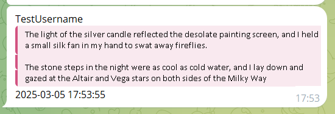
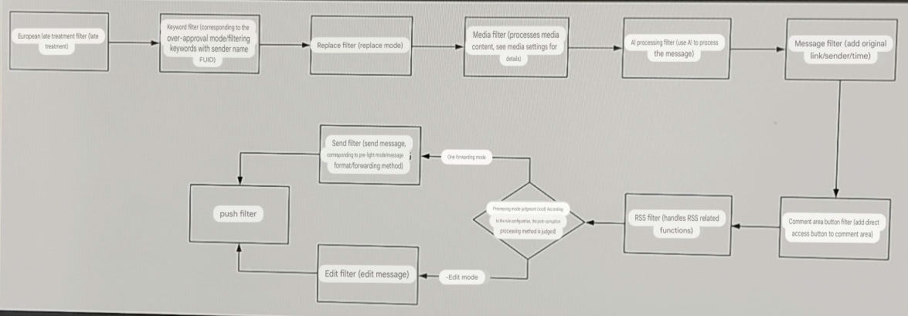
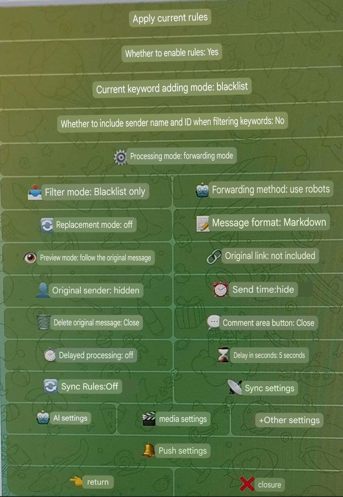
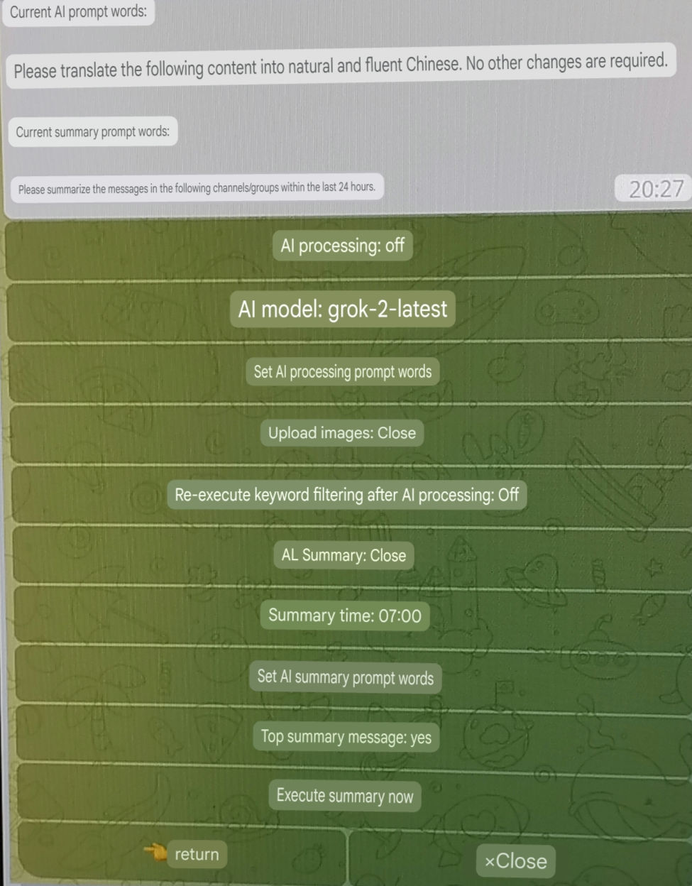
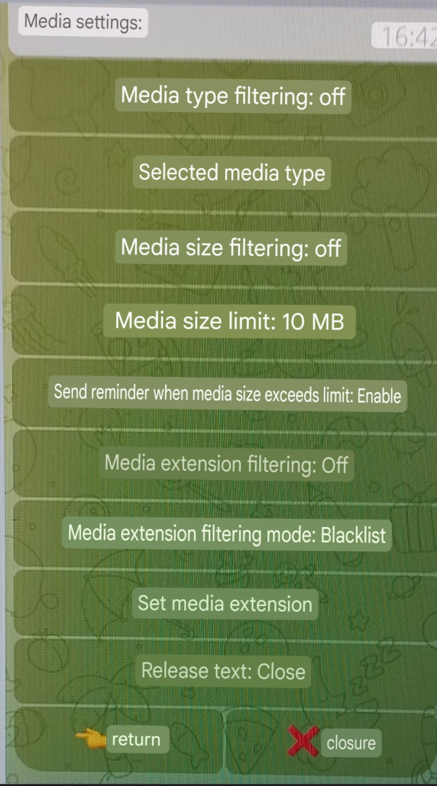
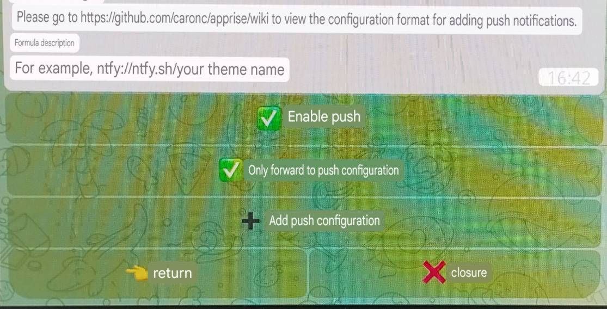
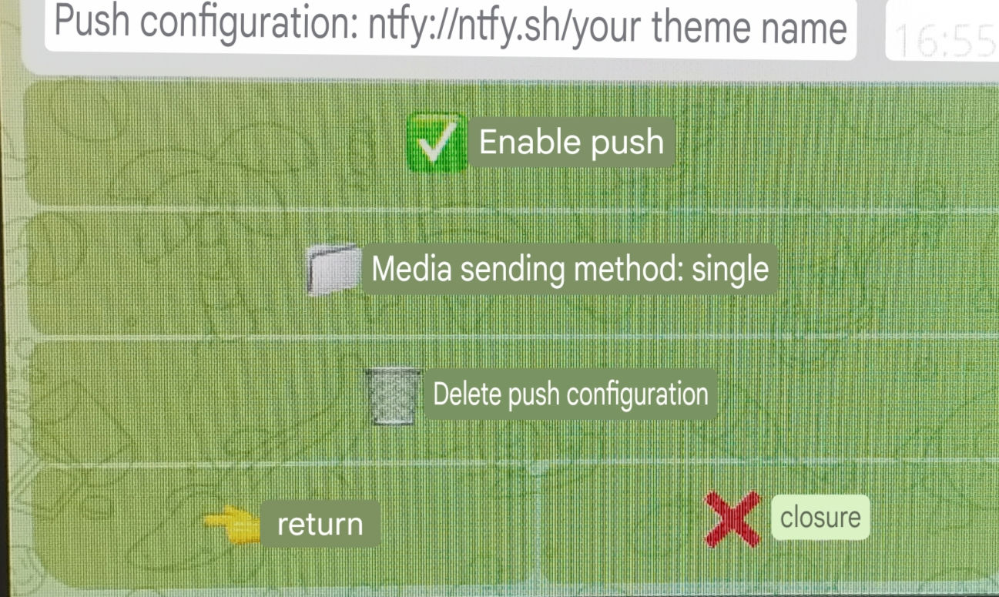
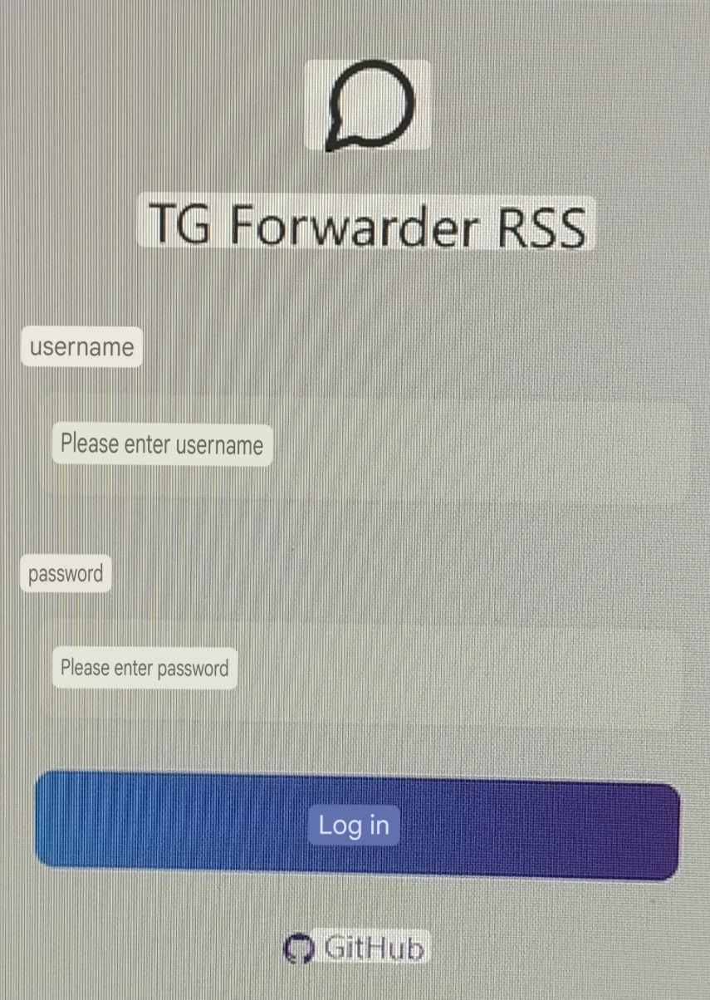
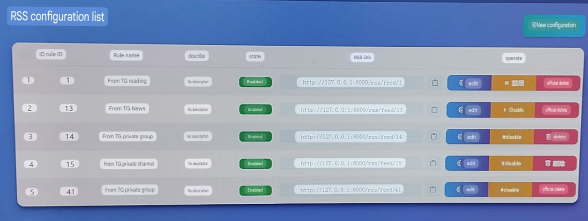
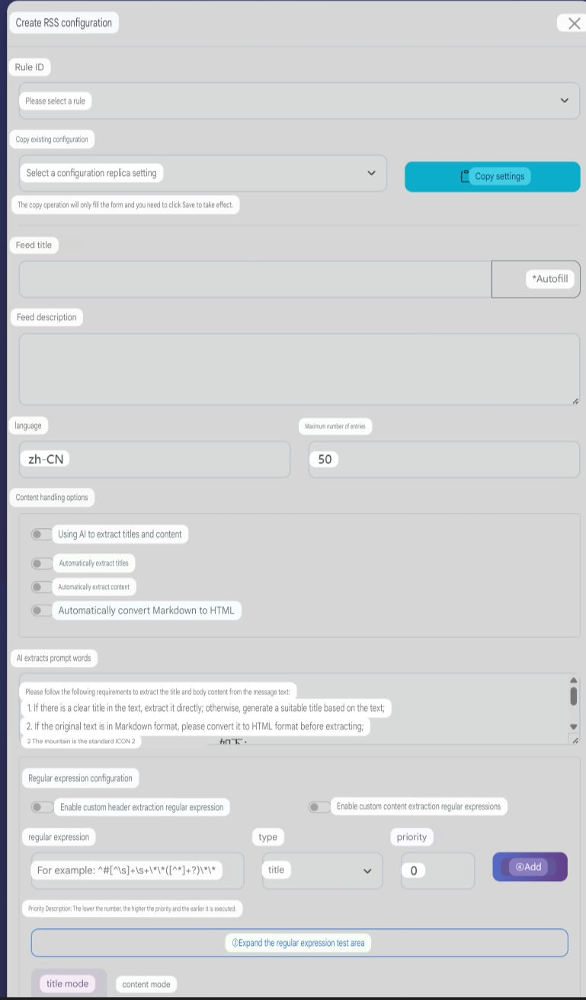

<h3><div align="center">Telegram Forwarder| Telegram Forwarder</div>

---

<div align="center">

[][docker-url] [](https://github.com/Heavrnl/TelegramForwarder/blob/main/LICENSE)

[docker-url]: https://hub.docker.com/r/heavrnl/telegramforwarder

</div>

## 📖 Introduction
Telegram forwarder is a powerful message forwarding tool. You only need to join the channel/group chat to forward the messages in the specified chat to other chats. You don't need the bot to enter the corresponding channel/group to listen. It can be used for information flow integration filtering, message reminders, content collection and other scenarios, without the restriction of forwarding/copying prohibition. In addition, with Apprise's powerful push function, you can easily distribute messages to various platforms such as chat software, email, SMS, Webhooks, APIs, etc.

## ✨ Features

- 🔄 **Multi-source forwarding**: Support forwarding from multiple sources to a specified target
- 🔍 **Keyword filtering**: support whitelist and blacklist modes
- 📝 **Regular Match**: Support regular expressions to match target text
- 📋 **Content modification**: Support multiple ways to modify message content
- 🤖 **AI processing**: Supports the use of AI interfaces from major manufacturers
- 📹 **Media Filter**: Supports filtering media files of specified types
- 📰 **RSS Subscription**: Support RSS subscription
- 📢 **Multi-platform push**: Support push to multiple platforms via Apprise

## 📋 Table of Contents

- [📖 Introduction](#-Introduction)
- [✨ Features](#-Features)
- [🚀 Quick Start](#-Quick Start)
  - [1️⃣ Preparation](#1️⃣-Preparation)
  - [2️⃣ Configure the environment](#2️⃣-Configure the environment)
  - [3️⃣ Start the service](#3️⃣-Start the service)
  - [4️⃣ Update](#4️⃣-Update)
- [📚 User Guide](#-User Guide)
  - [🌟Basic usage examples](#-Basic usage examples)
  - [🔧 Examples of special use scenarios](#-Examples of special use scenarios)
- [🛠️ Functional Details](#️-Functional Details)
  - [⚡ Filtering Process](#-Filtering Process)
  - [⚙️ Setup Instructions](#️- Setup Instructions)
    - [Main settings description](#Main settings description)
    - [Media Settings Instructions](#Media Settings Instructions)
  - [🤖 AI function](#-ai function)
    - [Configuration Instructions](#Configuration)
    - [Custom Model](#Custom Model)
    - AI Processing Capabilities
    - [Timed summary function](#Timed summary)
  - [📢 Push function](#-Push function)
    - [Settings](#Settings)
  - [📰 RSS Subscription](#-RSS Subscription)
    - [Enable RSS function](#Enable RSS function)
    - [Visit RSS dashboard](#Visit rss dashboard)
    - [Nginx configuration](#nginx configuration)
    - [RSS Configuration Instructions](#rss configuration management)
    - [Special settings](#Special settings)
    - [Notes](#Notes)
  
- [🎯 Special Features](#-Special Features)
  - [🔗 Link forwarding function](#-Link forwarding function)
- [📝Command list](#-Command list)
- [💐 Acknowledgements](#-Acknowledgements)
- [☕ Donate](#-Donate)
- [📄 Open Source Agreement](#-Open Source Agreement)


## 🚀 Quick Start

### 1️⃣ Preparation

1. Get Telegram API credentials:
   - Visit https://my.telegram.org/apps
   - Create an application to get `API_ID` and `API_HASH`

2. Get the robot token:
   - Chat with @BotFather to create a bot
   - Get the robot's `BOT_TOKEN`

3. Get the user ID:
   - Talk to @userinfobot to get your `USER_ID`

### 2️⃣ Configure the environment

Create a new folder
```bash
mkdir ./TelegramForwarder && cd ./TelegramForwarder
```
Download the repository's [**docker-compose.yml**](https://github.com/Heavrnl/TelegramForwarder/blob/main/docker-compose.yml) to the directory

Then download or copy the **[.env.example](./.env.example)** file from the repository, fill in the required fields, and rename it to `.env`
```bash
wget https://raw.githubusercontent.com/Heavrnl/TelegramForwarder/refs/heads/main/.env.example -O .env
```


### 3️⃣ Start the service

First run (authentication required):

```bash
docker-compose run -it telegram-forwarder
```
CTRL+C Exit the container

Modify the docker-compose.yml file and modify `stdin_open: false` and `tty: false`

Background operation:
```bash
docker-compose up -d
```

### 4️⃣ Update
Note: docker-compose does not need to pull the repository source code to run, unless you plan to build it yourself, otherwise you only need to execute the following command in the project directory to update.
```bash
docker-compose down
```
```bash
docker-compose pull
```
```bash
docker-compose up -d
```
## 📚 Usage Guide

### 🌟 Basic usage examples

Suppose you subscribe to the channels "TG News" (https://t.me/tgnews) and "TG Reading" (https://t.me/tgread) but want to filter out some content that you are not interested in:

1. Create a Telegram group/channel (eg: "My TG Filter")
2. Add the robot to a group/channel and set it as an administrator
3. Send the command in the **newly created** group/channel:
   ```bash
   /bind https://t.me/tgnews or /bind "TG News"
   /bind https://t.me/tgread or /bind "TG Reading"
   ```
4. Set the message processing mode:
   ```bash
   /settings
   ```
   Select the rules for the corresponding channel to be operated and set them according to your preferences
   
   For detailed setting instructions, please see [🛠️ Function Details](#️-Function Details)

5. Add blocked keywords:
   ```bash
   /add advertising promotion 'This is an advertisement'
   ```

6. If you find that the forwarded message format has problems (such as extra symbols), you can use regular expressions to process it:
   ```bash
   /replace \*\*
   ```
   This will remove all `**` symbols from the message.

>Note: The above operations of adding, deleting, modifying and checking only take effect on the first bound rule, in this example it is TG News. If you want to operate on TG Reading, you need to use `/settings(/s)` first, select TG Reading, and then click "Apply Current Rules" to perform the operations. You can also use `/add_all(/aa)`, `/replace_all(/ra)` and other commands to make two rules effective at the same time

In this way, you can receive filtered and formatted channel messages.

### 🔧 Examples of special use cases  

#### 1. Some messages in the TG channel are embedded in text links, so clicking on them will ask you to confirm before jumping, such as the official notification channel of NodeSeek  

The original message format of the channel
```Markdown
[**Post Title**](https://www.nodeseek.com/post-xxxx-1)
```  
You can use the following commands **sequentially** for the forwarding rules of the notification channel:  
```Plain Text
/replace \*\*
/replace \[(?:\[([^\]]+)\])?([^\]]+)\]\(([^)]+)\) [\1]\2\n(\3)
/replace \[\]\s*
```  
Eventually, all forwarded messages will be in the following format, so you can click on the link directly without confirming the jump:  
```Plain Text
Post title
(https://www.nodeseek.com/post-xxxx-1)
```  

---

#### 2. The format of the monitored user message is not beautiful, the message display method can be optimized  

**In order** use the following commands:  
```Plain Text
/r ^(?=.) <blockquote>
/r (?<=.)(?=$) </blockquote>
```  
Then set the message format to **HTML**, so that when monitoring user messages, the message format will be much more beautiful:  



---

#### 3. Synchronous rule operations  

In the Settings menu, turn on "Synchronize rules" and select a target rule. All operations of the current rule will be synchronized to the selected rule.  

Applicable to the following scenarios:  
- Do not want to process rules in the current window  
- Need to operate multiple rules at the same time  

If the current rule is only used for synchronization and does not need to be actually effective, you can set **Enable rule** to **No**.

---

#### 4. How to forward to favorites (Saved Messages)
> Not recommended, the operation is complicated
1. Send the following command in any group or channel managed by your bot:  
   ```bash
   /bind https://t.me/tgnews Your username (the name displayed)
   ```  

2. Create a new rule at will and set the following:  
   - **Turn on the synchronization function** and synchronize to **rules for forwarding favorites**
   - **Forwarding Mode** Select **"User Mode"**  
   - **Disable rule** (set the rule "Enable rule" to off)  

In this way, you can manage the rules of favorites in other rules, and all operations will be synchronized to the **Forward Favorites** rule.


## 🛠️ Functional Details

### ⚡ Filtering Process
First, we need to understand the order of message filtering. The options in brackets correspond to the settings:




### ⚙️ Setup Instructions
| Main settings interface | AI settings interface | Media settings interface |
|---------|------|------|
|  |  |  |

#### Main settings instructions
The following describes the setting options.
| Setup Options | Description |
|---------|------|
| Apply current rules | After selecting, the addition, deletion, modification, import and export of keyword instructions (/add, /remove_keyword, /list_keyword, etc.) and replacement instructions (/replace, /list_replace, etc.) will apply to the current rules |
| Enable the rule? | After selecting, the current rule will be enabled, otherwise it will be disabled |
| Current keyword adding mode | Click to switch between blacklist and whitelist mode. Since the blacklist and whitelist are processed separately, you need to switch manually. Note that the addition, deletion, modification and query of keywords are all related to the mode here. If you want to use instructions to add, delete, modify and query the whitelist of the current rule, please make sure the mode here is whitelist. |
| Whether to include sender name and ID when filtering keywords | When enabled, the sender name and ID information will be included when filtering keywords (it will not be added to the actual message), which can be used to filter for specific users |
| Processing Mode | You can switch between edit and forward modes. In edit mode, the original message will be modified directly; in forward mode, the processed message will be forwarded to the target chat. Note: Edit mode is only available if you are an administrator and the original message is a channel message or a message sent by yourself in the group. |
| Filtering Mode | You can switch between blacklist only/whitelist only/black first then white/white first then black mode. Since the blacklist and whitelist are stored separately, you can choose different filtering methods according to your needs. |
| Forwarding Mode | You can switch between user and robot modes. In user mode, use the user account to forward messages; in robot mode, use the robot account to send messages |
| Replace Mode | Once enabled, messages will be processed according to the set replacement rules |
| Message Format | You can switch between Markdown and HTML formats, which will take effect at the final sending stage. Generally, the default Markdown format is sufficient. |
| Preview Mode | You can switch on/off/follow the original message. When turned on, the first link in the message will be previewed, and the preview status of the original message will be followed by default. |
| Original sender/original link/sent time| If enabled, this information will be added when the message is sent. It is disabled by default. You can set a custom template in the "Other Settings" menu |
| Delay processing | After enabling, the original message content will be retrieved according to the set delay time, and then the processing process will start. It is suitable for channels/groups that frequently modify messages. Custom delay time can be added in config/delay_time.txt |
| Delete original message| The original message will be deleted after enabling. Please confirm whether you have the deletion permission before using it. |
| Direct access button to comment area | After enabling, add a direct access button to the comment area under the forwarded message, provided that the original message has a comment area |
| Sync to other rules | After enabling, the operations of the current rule will be synchronized to other rules. Except for "Whether to enable the rule" and "Enable synchronization", all other settings will be synchronized. |

#### Media Settings Instructions
| Setup Options | Description |
|---------|------|
| Media Type Filtering | When enabled, non-selected media types will be filtered out |
| Selected media type| Select the media type to be **blocked**. Note: Telegram has fixed classifications for media files, mainly these types: photo, document, video, audio, voice. All files that are not photos, videos, audio, or voice will be classified as "document". For example, virus files (.exe), compressed files (.zip), text files (.txt), etc., are all "document" types in Telegram. |
| Media size filtering | When enabled, media that exceeds the set size will be filtered out |
| Media size limit | Set media size limit in MB. You can add custom size in config/media_size.txt |
| Send reminder when media size exceeds limit | After enabling, a reminder message will be sent when media exceeds the limit |
| Media extension filtering | When enabled, the selected media extensions will be filtered out |
| Media extension filtering mode | Switch blacklist/whitelist mode |
| Selected media extensions | Select the media extensions to filter. You can add custom extensions in config/media_extensions.txt |
| Release text | When enabled, filtering media will not block the entire message, but forward the text separately |

#### Other settings instructions

Several commonly used commands are integrated into the other settings menu, allowing them to interact directly in the interface, including:
- Copy Rules
- Copy Keywords
- Copy Replacement Rules
- Clear keywords
- Clear Replacement Rules
- Delete Rule

Clearing keywords, clearing replacement rules, and deleting rules can take effect on other rules.

At the same time, you can set custom templates here, including: user information template, time template, original link template
| Setup Options | Description |
|---------|------|
|Invert Blacklist| When enabled, the blacklist will be treated as a whitelist. If the whitelist-then-blacklist mode is used, the blacklist will be treated as a second whitelist.|
|Invert whitelist| When enabled, the whitelist will be treated as a blacklist. If the whitelist-then-blacklist mode is used, the whitelist will be treated as the second blacklist.|

Combined with the "first X then X" mode, a dual-layer blacklist/whitelist mechanism can be implemented. For example, after reversing the blacklist, the blacklist in "first white then black" will become a second-level whitelist, which is suitable for monitoring specific users and filtering their special keywords.


### 🤖 AI Features

The project has built-in AI interfaces from major manufacturers, which can help you:
- Automatically translate foreign language content
- Regular summary of group messages
- Intelligent filtering of advertising information
- Automatically tag content
....
  
#### Configuration

1. Configure your AI interface in the `.env` file:
```ini
# OpenAI API
OPENAI_API_KEY=your_key
OPENAI_API_BASE= # Optional, default official interface

# Claude API
CLAUDE_API_KEY=your_key

# Other supported interfaces...
```

#### Custom Model

Didn't find the model name you want? Just add it in `config/ai_models.json`.

AI Processing

The following formats can be used in AI processing prompt words:
- `{source_message_context:number}` - Get the latest specified number of messages in the source chat window
- `{target_message_context:number}` - Get the latest specified number of messages in the target chat window
- `{source_message_time:number}` - Get the message of the source chat window in the last specified number of minutes
- `{target_message_time:number}` - Get the target chat window's messages within the last specified number of minutes

Examples of prompt words:

Pre-processing: After turning on AI processing, perform keyword filtering again and add "#不forward" to the filtering keywords.
```
This is an information integration channel that obtains news from multiple sources. Now you need to determine whether the new information is repeated with historical information content. If it is repeated, just reply "#Don't forward", otherwise please return to the original text of the new information and keep the format.
Remember, you can only return to the original text of "#notforward" or new information.
The following is historical information: {target_message_context:10}
Here is the new information:
```

#### Regular summary

After turning on the scheduled summary, the robot will automatically summarize the messages of the past 24 hours at the specified time (7 am every day by default).

- Multiple summary time points can be added in `config/summary_time.txt`
- Set default timezone in `.env`
- Customize summary prompts

> Note: The summary function will consume more API quota, please enable it as needed.

### 📢 Push function

In addition to forwarding internal messages in Telegram, the project also integrates Apprise. With its powerful push function, you can easily distribute messages to various platforms such as chat software, email, SMS, Webhooks, APIs, etc.

| Push settings main interface | Push settings sub-interface |
|---------|------|
|  |  |

#### Setup Instructions

| Setup Options | Description |
|---------|------|
| Forward only to push configuration | Skip forwarding filter after enabling, jump directly to push filter |
| Media sending method | Supports two modes:<br>- Single: each media file is pushed in a separate message<br>- All: all media files are merged into one message and pushed<br>Which mode to use depends on whether the target platform supports pushing multiple attachments at a time |

### How to add push configuration?
For a complete list of push platforms and configuration formats, please refer to the [Apprise Wiki](https://github.com/caronc/apprise/wiki)

**Example: Push using ntfy.sh**

* Assume you want to push to a topic called `my_topic` on ntfy.sh.
* According to the Apprise Wiki, the format is `ntfy://ntfy.sh/your_theme_name`.
* Then, the configuration URL you need to add is:
    ```
    ntfy://ntfy.sh/my_topic
    ```


## 📰 RSS Subscription

The project integrates the function of converting Telegram messages into RSS Feeds, which can easily convert Telegram channel/group content into standard RSS format, making it convenient to track through RSS readers.

### Enable RSS function

1. Configure RSS related parameters in the `.env` file:
   ```ini
   # RSS Configuration
   # Whether to enable RSS function (true/false)
   RSS_ENABLED=true
   # RSS base access URL. If left blank, the default access URL will be used (eg https://rss.example.com)
   RSS_BASE_URL=
   # RSS media file base URL. If left blank, the default access URL will be used (eg https://media.example.com)
   RSS_MEDIA_BASE_URL=
   ```
2. Uncomment the docker-compose.yml file
   ```
    # If you need to use the RSS function, please uncomment the following
     ports:
       - 9804:8000
   ```
3. Restart the service to enable the RSS function:
   ```bash
   docker-compose restart
   ```
> Note: Old version users need to redeploy with the new docker-compose.yml file: [docker-compose.yml](./docker-compose.yml)
### Access the RSS dashboard

Browser access `http://your server address:9804/`

### Nginx Configuration
```
location / {
        proxy_pass http://127.0.0.1:9804;
        proxy_http_version 1.1;
        proxy_set_header Upgrade $http_upgrade;
        proxy_set_header Connection "upgrade";
        proxy_set_header Host $host;
        proxy_set_header X-Forwarded-For $proxy_add_x_forwarded_for;
        proxy_set_header X-Forwarded-Proto $scheme;
        proxy_set_header X-Forwarded-Host $host;
    }
```

### RSS Configuration Management

Related interfaces

| Login interface | Dashboard interface | Create/edit configuration interface |
|---------|------|------|
|  |  |  |


### New/Edit Configuration Interface Description
| Setup Options | Description |
|---------|------|
| Rule ID | Select an existing forwarding rule to generate RSS subscription |
| Copy existing configuration | Select an existing RSS configuration and copy its configuration to the current form |
|Feed Title| Set Feed Title |
|AutoFill| Click to automatically generate a feed title based on the source chat window name of the rule |
|Feed Description| Set Feed Description |
|Language| Placeholder, no special function |
|Maximum number of entries| Set the maximum number of entries for the RSS feed, the default is 50. For chat sources with more media, please set it according to the actual hard disk size. |
|Use AI to extract titles and content| Once enabled, AI services will be used to automatically analyze messages, extract titles and content, and organize the format. Please set the AI ​​​​model in the bot. It is not affected by the "Whether to enable AI processing" option in the bot. Once this option is enabled, it is mutually exclusive with all the following configurations. |
|AI Extraction Prompt Words| Set AI to extract prompt words for titles and content. If you need to customize, please make sure AI returns the following json format content: `{ "title": "Title", "content": "Main content" }` |
|Automatically extract title| After enabling, the title will be automatically extracted by the preset regular expression |
|Automatically extract content| After enabling, the content will be automatically extracted by the preset regular expression |
|Automatically convert Markdown to HTML| Once enabled, the Markdown format in Telegram will be automatically converted to standard HTML using the relevant library. If you need to handle it yourself, please use `/replace` in the bot to replace it yourself |
|Enable custom header extraction regular expression| When enabled, a custom regular expression will be used to extract headers |
|Enable custom content extraction regular expression| When enabled, custom regular expressions will be used to extract content |
|Priority| Set the execution order of regular expressions. The smaller the number, the higher the priority. The system will execute regular expressions in order from high to low priority. **The result of the previous regular expression extraction will be used as the input of the next one** until all extractions are completed |
|Regular Expression Test| Can be used to test whether the current regular expression matches the target text |

Special Instructions
- If you only enable automatic title extraction but not automatic content extraction, the content will be the complete Telegram message with the title extracted
- If both the content processing option and the regular expression configuration are empty, the first 20 characters will be automatically matched as the title, and the content will be the original message


Special settings
If `RSS_ENABLED=true` is enabled in .env, a new option `Forward to RSS only` will be added to the bot's settings. When enabled, messages will be interrupted after various processing by the RSS filter and will not be forwarded/edited.


### Notes

- There is no password retrieval function, please keep your account password safe

## 🎯 Special Features

### 🔗 Link forwarding function

Send a message link to the bot to forward the message to the current chat window, ignoring the restrictions on forwarding and copying (the project's own functions already ignore the restrictions on forwarding and copying)

### 🔄 Linked with the general forum blocking plugin
> https://github.com/heavrnl/universalforumblock

Make sure that the relevant parameters have been configured in the .env file. Use `/ufb_bind <forum domain name>` in the chat window that has been bound to achieve three-way linkage shielding. Use `/ufb_item_change` to switch the homepage keyword/homepage username/content page keyword/content page username to be synchronized with the current domain name.

## 📝 Command List

```bash
Command List

Basic commands
/start - Start using
/help(/h) - Display this help information

Binding and Setup
/bind(/b) <source chat link or name> [target chat link or name] - bind to source chat
/settings(/s) [rule ID] - manage forwarding rules
/changelog(/cl) - View the changelog

Forwarding rule management
/copy_rule(/cr) <source rule ID> [destination rule ID] - copies all settings of the specified rule to the current rule or destination rule ID
/delete_rule(/dr) <rule ID> [rule ID] [rule ID] ... - Delete the specified rule
/list_rule(/lr) - List all forwarding rules

Keyword Management
/add(/a) <keyword> [keyword] ["keyword"] ['keyword'] ... - add a normal keyword
/add_regex(/ar) <regular expression> [regular expression] [regular expression] ... - Add a regular expression
/add_all(/aa) <keyword> [keyword] [keyword] ... - Adds a common keyword to all rules bound to the current channel
/add_regex_all(/ara) <regex> [regex] [regex] ... - Add regular expression keywords to all rules
/list_keyword(/lk) - List all keywords
/remove_keyword(/rk) <keyword> ["keyword"] ['keyword'] ... - remove a keyword
/remove_keyword_by_id(/rkbi) <ID> [ID] [ID] ... - remove a keyword by ID
/remove_all_keyword(/rak) <keyword> ["keyword"] ['keyword'] ... - removes the specified keyword from all rules bound to the current channel
/clear_all_keywords(/cak) - Clears all keywords for the current rule
/clear_all_keywords_regex(/cakr) - Clears all regular keywords of the current rule
/copy_keywords(/ck) <rule ID> - copies the keywords of the specified rule to the current rule
/copy_keywords_regex(/ckr) <rule ID> - copies the regular keywords of the specified rule to the current rule
/copy_replace(/crp) <rule ID> - copies the replacement rule of the specified rule to the current rule
/copy_rule(/cr) <rule ID> - copies all settings of the specified rule to the current rule (including keywords, regular expressions, replacement rules, media settings, etc.)

Replacement rule management
/replace(/r) <regular expression> [replacement content] - add replacement rules
/replace_all(/ra) <regular expression> [replace content] - add replacement rule to all rules
/list_replace(/lrp) - List all replace rules
/remove_replace(/rr) <number> - remove replace rule
/clear_all_replace(/car) - Clears all replacement rules for the current rule
/copy_replace(/crp) <rule ID> - copies the replacement rule of the specified rule to the current rule

Import and Export
/export_keyword(/ek) - Export the keyword of the current rule
/export_replace(/er) - Export the replacement rules for the current rule
/import_keyword(/ik) <send file at the same time> - import common keywords
/import_regex_keyword(/irk) <send file at the same time> - import regular keyword
/import_replace(/ir) <send file at the same time> - import replace rules

RSS related
/delete_rss_user(/dru) [username] - delete RSS user

UFB related
/ufb_bind(/ub) <domain name> - bind UFB domain name
/ufb_unbind(/uu) - Unbind UFB domain name
/ufb_item_change(/uic) - Toggle UFB sync configuration type

hint
• The command in brackets is a short form
• Angle brackets <> indicate required parameters
• Square brackets [] indicate optional parameters
• The import command requires the file to be sent at the same time
```

## 💐 Acknowledgements

- [Apprise](https://github.com/caronc/apprise)
- [Telethon](https://github.com/LonamiWebs/Telethon)

## ☕ Donate

If you find this project helpful, please buy me a cup of coffee via:

[](https://ko-fi.com/0heavrnl)


## 📄 Open Source Agreement

This project adopts the [GPL-3.0](LICENSE) open source agreement. For more information, please refer to the [LICENSE](LICENSE) file.
