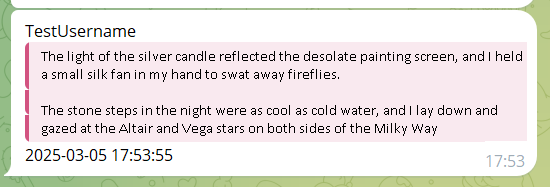
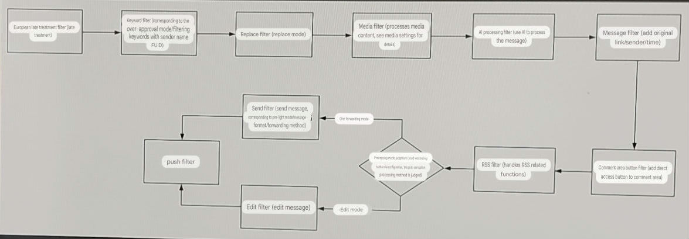
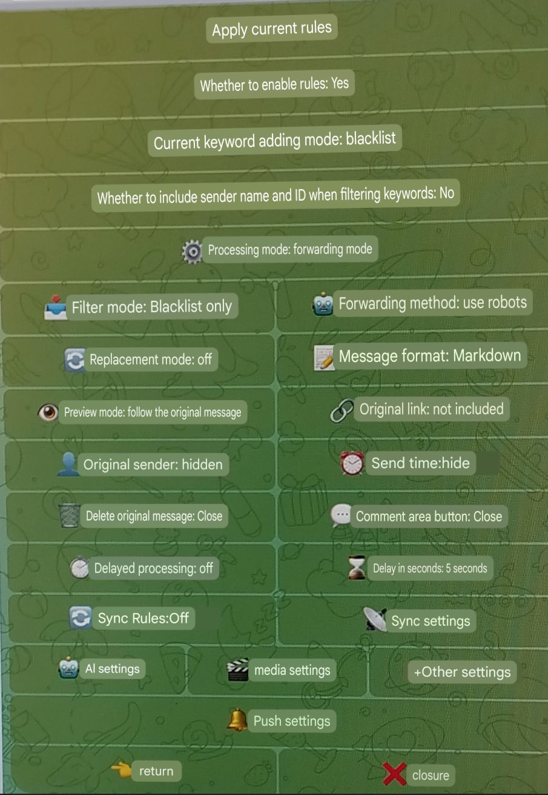
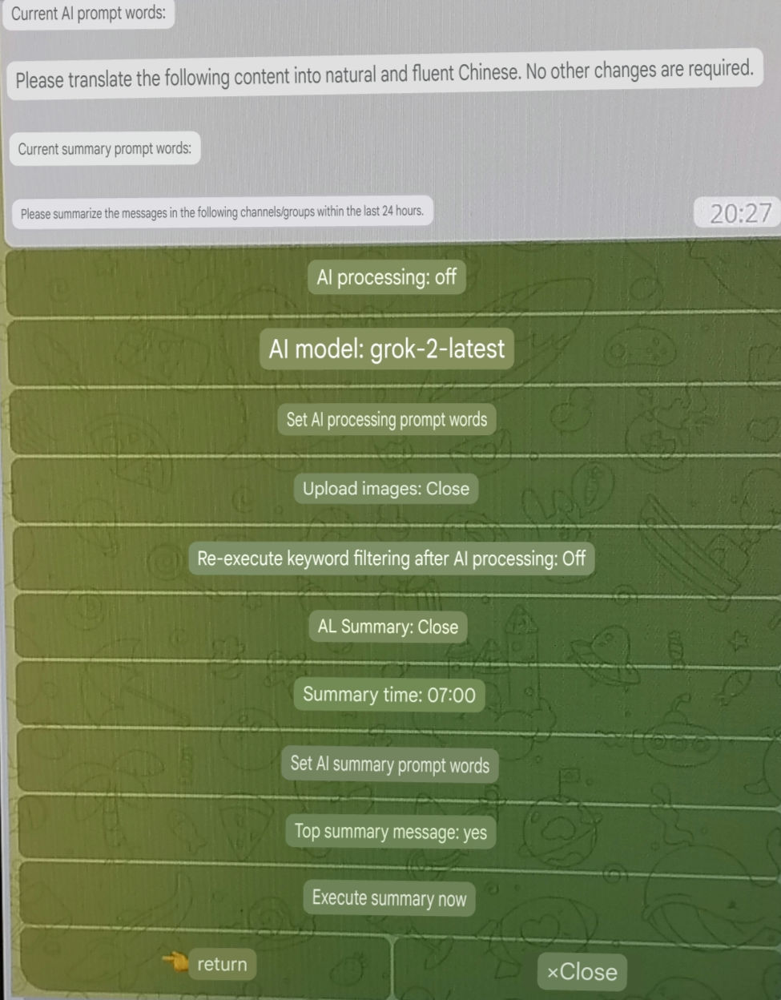
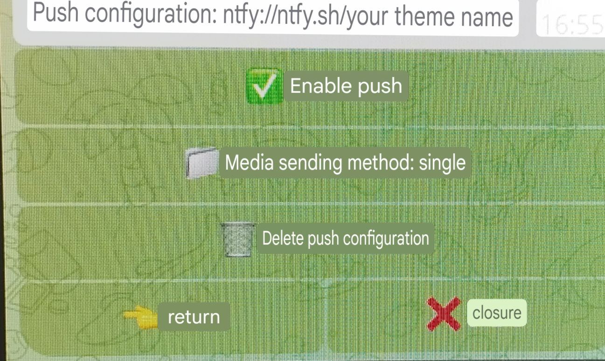
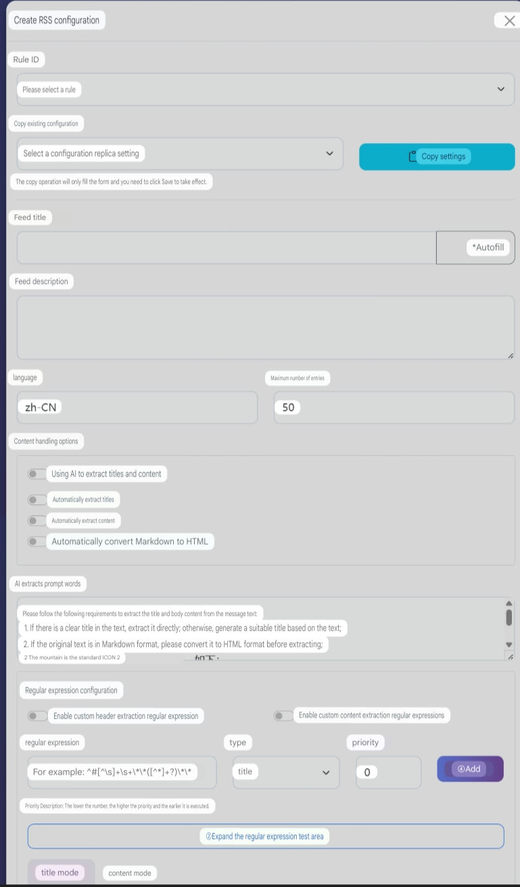

<h3><div align="center">Telegram Forwarder| Telegram Forwarder</div>

---

<div align="center">

[][docker-url] [](https://github.com/Heavrnl/TelegramForwarder/blob/main/LICENSE)

[docker-url]: https://hub.docker.com/r/heavrnl/telegramforwarder

</div>

## 📖 Introduction
Telegram forwarder is a powerful message forwarding tool. You only need to join the channel/group chat to forward the messages in the specified chat to other chats. You don't need the bot to enter the corresponding channel/group to listen. It can be used for information flow integration filtering, message reminders, content collection and other scenarios, without the restriction of forwarding/copying prohibition. In addition, with Apprise's powerful push function, you can easily distribute messages to various platforms such as chat software, email, SMS, Webhooks, APIs, etc.

## ✨ Features

- 🔄 **Multi-source forwarding**: Support forwarding from multiple sources to a specified target
- 🔍 **Keyword filtering**: support whitelist and blacklist modes
- 📝 **Regular Match**: Support regular expressions to match target text
- 📋 **Content modification**: Support multiple ways to modify message content
- 🤖 **AI processing**: Supports the use of AI interfaces from major manufacturers
- 📹 **Media Filter**: Supports filtering media files of specified types
- 📰 **RSS Subscription**: Support RSS subscription
- 📢 **Multi-platform push**: Support push to multiple platforms via Apprise

## 📋 Table of Contents

- [📖 Introduction](#-Introduction)
- [✨ Features](#-Features)
- [🚀 Quick Start](#-Quick Start)
  - [1️⃣ Preparation](#1️⃣-Preparation)
  - [2️⃣ Configure the environment](#2️⃣-Configure the environment)
  - [3️⃣ Start the service](#3️⃣-Start the service)
  - [4️⃣ Update](#4️⃣-Update)
- [📚 User Guide](#-User Guide)
  - [🌟 Basic usage examples](#-Basic usage examples)
  - [🔧 Examples of special use scenarios](#-Examples of special use scenarios)
- [🛠️ Functional Details](#️-Functional Details)
  - [⚡ Filtering Process](#-Filtering Process)
  - [⚙️ Setup Instructions](#️- Setup Instructions)
    - [Main settings description](#Main settings description)
    - [Media Settings Instructions](#Media Settings Instructions)
  - [🤖 AI function](#-ai function)
    - [Configuration Instructions](#Configuration)
    - [Custom Model](#Custom Model)
    - AI Processing Capabilities
    - [Timed summary function](#Timed summary)
  - [📢 Push function](#-Push function)
    - [Settings](#Settings)
  - [📰 RSS Subscription](#-RSS Subscription)
    - [Enable RSS function](#Enable RSS function)
    - [Visit RSS dashboard](#Visit rss dashboard)
    - [Nginx configuration](#nginx configuration)
    - [RSS Configuration Instructions](#rss configuration management)
    - [Special settings](#Special settings)
    - [Notes](#Notes)
  
- [🎯 Special Features](#-Special Features)
  - [🔗 Link forwarding function](#-Link forwarding function)
- [📝 Command list](#-Command list)
- [💐 Acknowledgements](#-Acknowledgements)
- [☕ Donate](#-Donate)
- [📄 Open Source Agreement](#-Open Source Agreement)


## 🚀 Quick Start

### 1️⃣ Preparation

1. Get Telegram API credentials:
   - Visit https://my.telegram.org/apps
   - Create an application to get `API_ID` and `API_HASH`

2. Get the robot token:
   - Chat with @BotFather to create a bot
   - Get the robot's `BOT_TOKEN`

3. Get the user ID:
   - Talk to @userinfobot to get your `USER_ID`

### 2️⃣ Configure the environment

Create a new folder
```bash
mkdir ./TelegramForwarder && cd ./TelegramForwarder
```
Download the repository's [**docker-compose.yml**](https://github.com/Heavrnl/TelegramForwarder/blob/main/docker-compose.yml) to the directory

Then download or copy the **[.env.example](./.env.example)** file from the repository, fill in the required fields, and rename it to `.env`
```bash
wget https://raw.githubusercontent.com/Heavrnl/TelegramForwarder/refs/heads/main/.env.example -O .env
```


### 3️⃣ Start the service

First run (authentication required):

```bash
docker-compose run -it telegram-forwarder
```
CTRL+C Exit the container

Modify the docker-compose.yml file and modify `stdin_open: false` and `tty: false`

Background operation:
```bash
docker-compose up -d
```

### 4️⃣ Update
Note: docker-compose does not need to pull the repository source code to run, unless you plan to build it yourself, otherwise you only need to execute the following command in the project directory to update.
```bash
docker-compose down
```
```bash
docker-compose pull
```
```bash
docker-compose up -d
```
## 📚 Usage Guide

### 🌟 Basic usage examples

Suppose you subscribe to the channels "TG News" (https://t.me/tgnews) and "TG Reading" (https://t.me/tgread) but want to filter out some content that you are not interested in:

1. Create a Telegram group/channel (eg: "My TG Filter")
2. Add the robot to a group/channel and set it as an administrator
3. Send the command in the **newly created** group/channel:
   ```bash
   /bind https://t.me/tgnews or /bind "TG News"
   /bind https://t.me/tgread or /bind "TG Reading"
   ```
4. Set the message processing mode:
   ```bash
   /settings
   ```
   Select the rules for the corresponding channel to be operated and set them according to your preferences
   
   For detailed setting instructions, please see [🛠️ Function Details](#️-Function Details)

5. Add blocked keywords:
   ```bash
   /add 广告 推广 '这是 广告'
   ```

6. 如果发现转发的消息格式有问题（比如有多余的符号），可以使用正则表达式处理：
   ```bash
   /replace \*\*
   ```
   这会删除消息中的所有 `**` 符号

>注意：以上增删改查操作，只对第一个绑定的规则生效，示例里是TG 新闻。若想对TG 阅读进行操作，需要先使用`/settings(/s)`，选择TG 阅读，再点击"应用当前规则"，就可以对此进行增删改查操作了。也可以使用`/add_all(/aa)`，`/replace_all(/ra)`等指令同时对两条规则生效

这样，你就能收到经过过滤和格式化的频道消息了

### 🔧 特殊使用场景示例  

#### 1. TG 频道的部分消息由于文字嵌入链接，点击会让你确认再跳转，例如 NodeSeek 的官方通知频道  

频道的原始消息格式 
```markdown
[**贴子标题**](https://www.nodeseek.com/post-xxxx-1)
```  
可以对通知频道的转发规则 **依次** 使用以下指令：  
```plaintext
/replace \*\*
/replace \[(?:\[([^\]]+)\])?([^\]]+)\]\(([^)]+)\) [\1]\2\n(\3)
/replace \[\]\s*
```  
最终所有转发的消息都会变成以下格式，这样直接点击链接就无需确认跳转：  
```plaintext
贴子标题
(https://www.nodeseek.com/post-xxxx-1)
```  

---

#### 2. 监听用户消息格式不美观，可优化消息显示方式  

**依次** 使用以下指令：  
```plaintext
/r ^(?=.) <blockquote>
/r (?<=.)(?=$) </blockquote>
```  
然后设置消息格式为 **HTML**，这样监听用户消息时，消息格式就会美观很多：  



---

#### 3. 同步规则操作  

在 **设置菜单** 中开启 **"同步规则"**，并选择 **目标规则**，当前规则的所有操作将同步到选定的规则。  

适用于以下场景：  
- 不想在当前窗口处理规则  
- 需要同时操作多个规则  

如果当前规则仅用于同步而不需实际生效，可将 **"是否启用规则"** 设置为 **"否"**。

---

#### 4. 如何转发到收藏夹 (Saved Messages)
> 不推荐，操作比较繁琐
1. 在你的 bot 管理的任意群组或频道中发送以下命令：  
   ```bash
   /bind https://t.me/tgnews 你的用户名（即展示的名称）
   ```  

2. 随意新建一个规则，并进行以下设置：  
   - **开启同步功能**，同步到 **转发收藏夹的规则**
   - **转发模式** 选择 **"用户模式"**  
   - **禁用规则**（将规则”是否启用规则“设置为关闭）  

这样，你就可以在其他规则中管理收藏夹的规则，所有操作都会同步到 **转发收藏夹** 规则中。


## 🛠️ 功能详解

### ⚡ 过滤流程
首先要清楚消息过滤顺序，括号里对应设置里的选项：




### ⚙️ 设置说明
| 主设置界面 | AI设置界面 | 媒体设置界面 |
|---------|------|------|
|  |  |  |

#### 主设置说明
以下对设置选项进行说明
| 设置选项 | 说明 |
|---------|------|
| 应用当前规则 | 选择后，关键字指令(/add,/remove_keyword,/list_keyword等)和替换指令(/replace,/list_replace等)的增删改查导入导出将作用于当前规则 |
| 是否启用规则 | 选择后，当前规则将被启用，否则将被禁用 |
| 当前关键字添加模式 | 点击可切换黑/白名单模式，由于黑白名单是分开处理的，需要手动切换，注意，此时关键字的增删改查都和这里的模式有关，如果要使用指令对当前规则的白名单进行增删改查操作，请确保这里的模式是白名单 |
| 过滤关键字时是否附带发送者名称和ID | 启用后，过滤关键字时会包含发送者名称和ID信息(不会添加到实际消息中)，可用于针对特定用户进行过滤 |
| 处理模式 | 可切换编辑/转发模式。编辑模式下会直接修改原消息；转发模式下会将处理后的消息转发到目标聊天。注意:编辑模式仅适用于你是管理员的且原消息是频道消息或群组中自己发送的消息 |
| 过滤模式 | 可切换仅黑名单/仅白名单/先黑后白/先白后黑模式。由于黑白名单分开存储，可根据需要选择不同的过滤方式 |
| 转发模式 | 可切换用户/机器人模式。用户模式下使用用户账号转发消息；机器人模式下使用机器人账号发送消息 |
| 替换模式 | 启用后将根据已设置的替换规则对消息进行处理 |
| 消息格式 | 可切换Markdown/HTML格式，在最终发送阶段生效，一般使用默认的Markdown即可 |
| 预览模式 | 可切换开启/关闭/跟随原消息。开启后会预览消息中的第一个链接，默认跟随原消息的预览状态 |
| 原始发送者/原始链接/发送时间 | 启用后会在消息发送时添加这些信息，默认关闭，可在"其他设置"菜单中设置自定义模板 |
| 延时处理 | 启用后会按设定的延迟时间重新获取原消息内容，再开始处理流程，适用于频繁修改消息的频道/群组，可在 config/delay_time.txt 中添加自定义延迟时间 |
| 删除原始消息 | 启用后会删除原消息，使用前请确认是否有删除权限 |
| 评论区直达按钮 | 启用后在转发后的消息下发添加评论区直达按钮，前提是原消息有评论区 |
| 同步到其他规则 | 启用后会同步当前规则的操作到其他规则，除了"是否启用规则"和"开启同步"其他设置都会同步 |

#### 媒体设置说明
| 设置选项 | 说明 |
|---------|------|
| 媒体类型过滤 | 启用后会过滤掉非选中的媒体类型 |
| 选择的媒体类型 | 选择要**屏蔽**的媒体类型，注意：Telegram对媒体文件的分类是固定的，主要就是这几种，图片 (photo)，文档 (document)，视频 (video)，音频 (audio)，语音 (voice)，其中所有不属于图片、视频、音频、语音的文件都会被归类为"文档"类型。比如病毒文件(.exe)、压缩包(.zip)、文本文件(.txt)等，在 Telegram 中都属于"文档"类型。 |
| 媒体大小过滤 | 启用后会过滤掉超过设置大小的媒体 |
| Media size limit | Set media size limit in MB. You can add custom size in config/media_size.txt |
| Send reminder when media size exceeds limit | After enabling, a reminder message will be sent when media exceeds the limit |
| Media extension filtering | When enabled, the selected media extensions will be filtered out |
| Media extension filtering mode | Switch blacklist/whitelist mode |
| Selected media extensions | Select the media extensions to filter. You can add custom extensions in config/media_extensions.txt |
| Release text | When enabled, filtering media will not block the entire message, but forward the text separately |

#### Other settings instructions

Several commonly used commands are integrated into the other settings menu, allowing them to interact directly in the interface, including:
- Copy Rules
- Copy Keywords
- Copy Replacement Rules
- Clear keywords
- Clear Replacement Rules
- Delete Rule

Clearing keywords, clearing replacement rules, and deleting rules can take effect on other rules.

At the same time, you can set custom templates here, including: user information template, time template, original link template
| Setup Options | Description |
|---------|------|
|Invert Blacklist| When enabled, the blacklist will be treated as a whitelist. If the whitelist-then-blacklist mode is used, the blacklist will be treated as a second whitelist.|
|Invert whitelist| When enabled, the whitelist will be treated as a blacklist. If the whitelist-then-blacklist mode is used, the whitelist will be treated as the second blacklist.|

Combined with the "first X then X" mode, a dual-layer blacklist/whitelist mechanism can be implemented. For example, after reversing the blacklist, the blacklist in "first white then black" will become a second-level whitelist, which is suitable for monitoring specific users and filtering their special keywords.


### 🤖 AI Features

The project has built-in AI interfaces from major manufacturers, which can help you:
- Automatically translate foreign language content
- Regular summary of group messages
- Intelligent filtering of advertising information
- Automatically tag content
....
  
#### Configuration

1. Configure your AI interface in the `.env` file:
```ini
# OpenAI API
OPENAI_API_KEY=your_key
OPENAI_API_BASE= # Optional, default official interface

# Claude API
CLAUDE_API_KEY=your_key

# Other supported interfaces...
```

#### Custom Model

Didn’t find the model name you want? Just add it in `config/ai_models.json`.

#### AI Processing

The following formats can be used in AI processing prompt words:
- `{source_message_context:number}` - Get the latest specified number of messages in the source chat window
- `{target_message_context:number}` - Get the latest specified number of messages in the target chat window
- `{source_message_time:number}` - Get the message of the source chat window in the last specified number of minutes
- `{target_message_time:number}` - Get the target chat window's messages within the last specified number of minutes

Examples of prompt words:

Pre-processing: After turning on AI processing, perform keyword filtering again and add "#不转发" to the filtering keywords.
```
This is an information integration channel that obtains news from multiple sources. Now you need to determine whether the new information is repeated with historical information content. If it is repeated, just reply "#Don't forward", otherwise please return to the original text of the new information and keep the format.
Remember, you can only return to the original text of "#notforward" or new information.
The following is historical information: {target_message_context:10}
Here is the new information:
```

#### Regular summary

After turning on the scheduled summary, the robot will automatically summarize the messages of the past 24 hours at the specified time (7 am every day by default).

- Multiple summary time points can be added in `config/summary_time.txt`
- Set default timezone in `.env`
- Customize summary prompts

> Note: The summary function will consume more API quota, please enable it as needed.

### 📢 Push function

In addition to forwarding internal messages in Telegram, the project also integrates Apprise. With its powerful push function, you can easily distribute messages to various platforms such as chat software, email, SMS, Webhooks, APIs, etc.

| Push settings main interface | Push settings sub-interface |
|---------|------|
|  |  |

#### Setup Instructions

| Setup Options | Description |
|---------|------|
| Forward only to push configuration | Skip forwarding filter after enabling, jump directly to push filter |
| Media sending method | Supports two modes:<br>- Single: each media file is pushed in a separate message<br>- All: all media files are merged into one message and pushed<br>Which mode to use depends on whether the target platform supports pushing multiple attachments at a time |

### How to add push configuration?
For a complete list of push platforms and configuration formats, please refer to the [Apprise Wiki](https://github.com/caronc/apprise/wiki)

**Example: Push using ntfy.sh**

* Assume you want to push to a topic called `my_topic` on ntfy.sh.
* According to the Apprise Wiki, the format is `ntfy://ntfy.sh/your_theme_name`.
* Then, the configuration URL you need to add is:
    ```
    ntfy://ntfy.sh/my_topic
    ```


## 📰 RSS Subscription

The project integrates the function of converting Telegram messages into RSS Feeds, which can easily convert Telegram channel/group content into standard RSS format, making it convenient to track through RSS readers.

### Enable RSS function

1. Configure RSS related parameters in the `.env` file:
   ```ini
   # RSS Configuration
   # Whether to enable RSS function (true/false)
   RSS_ENABLED=true
   # RSS base access URL. If left blank, the default access URL will be used (e.g. https://rss.example.com)
   RSS_BASE_URL=
   # RSS media file base URL. If left blank, the default access URL will be used (e.g. https://media.example.com)
   RSS_MEDIA_BASE_URL=
   ```
2. Uncomment the docker-compose.yml file
   ```
    # If you need to use the RSS function, please uncomment the following
     ports:
       - 9804:8000
   ```
3. Restart the service to enable the RSS function:
   ```bash
   docker-compose restart
   ```
> Note: Old version users need to redeploy with the new docker-compose.yml file: [docker-compose.yml](./docker-compose.yml)
### Access the RSS dashboard

Browser access `http://your server address:9804/`

### Nginx Configuration
```
location / {
        proxy_pass http://127.0.0.1:9804;
        proxy_http_version 1.1;
        proxy_set_header Upgrade $http_upgrade;
        proxy_set_header Connection "upgrade";
        proxy_set_header Host $host;
        proxy_set_header X-Forwarded-For $proxy_add_x_forwarded_for;
        proxy_set_header X-Forwarded-Proto $scheme;
        proxy_set_header X-Forwarded-Host $host;
    }
```

### RSS Configuration Management

Related interfaces

| Login interface | Dashboard interface | Create/edit configuration interface |
|---------|------|------|
|  |  |  |


### New/Edit Configuration Interface Description
| Setup Options | Description |
|---------|------|
| Rule ID | Select an existing forwarding rule to generate RSS subscription |
| Copy existing configuration | Select an existing RSS configuration and copy its configuration to the current form |
|Feed Title| Set Feed Title |
|AutoFill| Click to automatically generate a feed title based on the source chat window name of the rule |
|Feed Description| Set Feed Description |
|Language| Placeholder, no special function |
|Maximum number of entries| Set the maximum number of entries for the RSS feed, the default is 50. For chat sources with more media, please set it according to the actual hard disk size. |
|Use AI to extract titles and content| Once enabled, AI services will be used to automatically analyze messages, extract titles and content, and organize the format. Please set the AI ​​model in the bot. It is not affected by the "Whether to enable AI processing" option in the bot. Once this option is enabled, it is mutually exclusive with all the following configurations. |
|AI Extraction Prompt Words| Set AI to extract prompt words for titles and content. If you need to customize, please make sure AI returns the following json format content: `{ "title": "Title", "content": "Main content" }` |
|Automatically extract title| After enabling, the title will be automatically extracted by the preset regular expression |
|Automatically extract content| After enabling, the content will be automatically extracted by the preset regular expression |
|Automatically convert Markdown to HTML| Once enabled, the Markdown format in Telegram will be automatically converted to standard HTML using the relevant library. If you need to handle it yourself, please use `/replace` in the bot to replace it yourself |
|Enable custom header extraction regular expression| When enabled, a custom regular expression will be used to extract headers |
|Enable custom content extraction regular expression| When enabled, custom regular expressions will be used to extract content |
|Priority| Set the execution order of regular expressions. The smaller the number, the higher the priority. The system will execute regular expressions in order from high to low priority. **The result of the previous regular expression extraction will be used as the input of the next one** until all extractions are completed |
|Regular Expression Test| Can be used to test whether the current regular expression matches the target text |

### Special Instructions
- If you only enable automatic title extraction but not automatic content extraction, the content will be the complete Telegram message with the title extracted
- If both the content processing option and the regular expression configuration are empty, the first 20 characters will be automatically matched as the title, and the content will be the original message


### Special settings
If `RSS_ENABLED=true` is enabled in .env, a new option `Forward to RSS only` will be added to the bot's settings. When enabled, messages will be interrupted after various processing by the RSS filter and will not be forwarded/edited.


### Notes

- There is no password retrieval function, please keep your account password safe

## 🎯 Special Features

### 🔗 Link forwarding function

Send a message link to the bot to forward the message to the current chat window, ignoring the restrictions on forwarding and copying (the project's own functions already ignore the restrictions on forwarding and copying)

### 🔄 Linked with the general forum blocking plugin
> https://github.com/heavrnl/universalforumblock

Make sure that the relevant parameters have been configured in the .env file. Use `/ufb_bind <forum domain name>` in the chat window that has been bound to achieve three-way linkage shielding. Use `/ufb_item_change` to switch the homepage keyword/homepage username/content page keyword/content page username to be synchronized with the current domain name.

## 📝 Command List

```bash
Command List

Basic commands
/start - Start using
/help(/h) - Display this help information

Binding and Setup
/bind(/b) <source chat link or name> [target chat link or name] - bind to source chat
/settings(/s) [rule ID] - manage forwarding rules
/changelog(/cl) - View the changelog

Forwarding rule management
/copy_rule(/cr) <source rule ID> [destination rule ID] - copies all settings of the specified rule to the current rule or destination rule ID
/delete_rule(/dr) <rule ID> [rule ID] [rule ID] ... - Delete the specified rule
/list_rule(/lr) - List all forwarding rules

Keyword Management
/add(/a) <keyword> [keyword] ["keyword"] ['keyword'] ... - add a normal keyword
/add_regex(/ar) <regular expression> [regular expression] [regular expression] ... - Add a regular expression
/add_all(/aa) <keyword> [keyword] [keyword] ... - Adds a common keyword to all rules bound to the current channel
/add_regex_all(/ara) <regex> [regex] [regex] ... - Add regular expression keywords to all rules
/list_keyword(/lk) - List all keywords
/remove_keyword(/rk) <keyword> ["keyword"] ['keyword'] ... - remove a keyword
/remove_keyword_by_id(/rkbi) <ID> [ID] [ID] ... - remove a keyword by ID
/remove_all_keyword(/rak) <keyword> ["keyword"] ['keyword'] ... - removes the specified keyword from all rules bound to the current channel
/clear_all_keywords(/cak) - Clears all keywords for the current rule
/clear_all_keywords_regex(/cakr) - Clears all regular keywords of the current rule
/copy_keywords(/ck) <rule ID> - copies the keywords of the specified rule to the current rule
/copy_keywords_regex(/ckr) <rule ID> - copies the regular keywords of the specified rule to the current rule
/copy_replace(/crp) <rule ID> - copies the replacement rule of the specified rule to the current rule
/copy_rule(/cr) <rule ID> - copies all settings of the specified rule to the current rule (including keywords, regular expressions, replacement rules, media settings, etc.)

Replacement rule management
/replace(/r) <regular expression> [replacement content] - add replacement rules
/replace_all(/ra) <regular expression> [replace content] - add replacement rule to all rules
/list_replace(/lrp) - List all replace rules
/remove_replace(/rr) <number> - remove replace rule
/clear_all_replace(/car) - Clears all replacement rules for the current rule
/copy_replace(/crp) <rule ID> - copies the replacement rule of the specified rule to the current rule

Import and Export
/export_keyword(/ek) - Export the keyword of the current rule
/export_replace(/er) - Export the replacement rules for the current rule
/import_keyword(/ik) <send file at the same time> - import common keywords
/import_regex_keyword(/irk) <send file at the same time> - import regular keyword
/import_replace(/ir) <send file at the same time> - import replace rules

RSS related
/delete_rss_user(/dru) [username] - delete RSS user

UFB related
/ufb_bind(/ub) <domain name> - bind UFB domain name
/ufb_unbind(/uu) - Unbind UFB domain name
/ufb_item_change(/uic) - Toggle UFB sync configuration type

hint
• The command in brackets is a short form
• Angle brackets <> indicate required parameters
• Square brackets [] indicate optional parameters
• The import command requires the file to be sent at the same time
```

## 💐 Acknowledgements

- [Apprise](https://github.com/caronc/apprise)
- [Telethon](https://github.com/LonamiWebs/Telethon)

## ☕ Donate

If you find this project helpful, please buy me a cup of coffee via:

[](https://ko-fi.com/0heavrnl)


## 📄 Open Source Agreement

This project adopts the [GPL-3.0](LICENSE) open source agreement. For more information, please refer to the [LICENSE](LICENSE) file.


